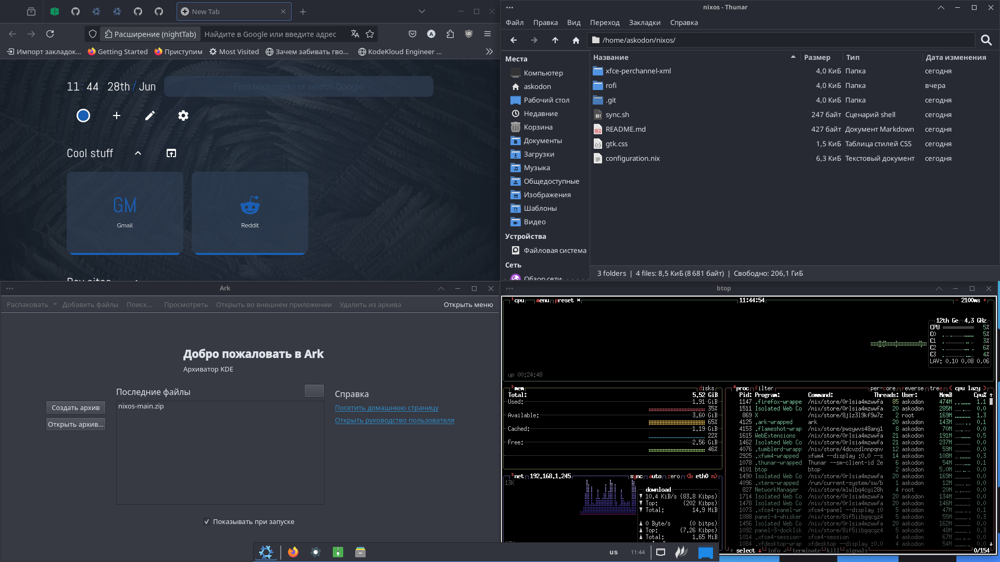

my nix conf
```
git clone https://github.com/Askodon/nixos.git
cd nixos
cp configuration.nix /etc/nixos/configuration.nix
sudo nixos-rebuild switch
flatpak remote-add --if-not-exists flathub https://dl.flathub.org/repo/flathub.flatpakrepo
cp -r rofi /home/askodon/.config
dconf load /org/cinnamon/ < cinnamon.dconf
dconf load /org/nemo/ < nemo.dconf
dconf load /org/gtk/ < gtk.dconf
dconf load /org/gnome/ < gnome.dconf
```
#image

