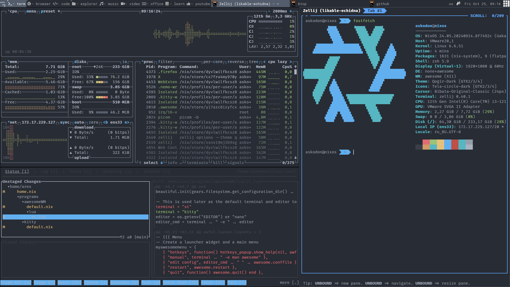

[](https://nixos.org)
[]()
[](https://www.linux.org/)


## Image




## Structure
```plaintext
.
├── home 🏠           # Common home-manager configuration for all hosts.
│   ├── help 📚       # Help info
│   ├── images 🎨     # All screenshots, icons and etc
│   ├── programs 🔧   # Programs settings on nix
│   └── scripts 🚀    # Sh files
├── nixos 💻          # Nixos base configuration
└──── modules ⚙️      # User settings, services and etc
```

## Host

Following hosts are available:

| Host         | Type     | 
| ------------ | -------  |
| `artemis`    | main pc  |
| `ares`       | for work |
| `apollo`     | for test |
| `athena`     | for kde  |


## Tools

|                             | Artemis(Wayland)                   | Ares(Xorg)                                                                      |
| --------------------------- | :----------------------------------|---------------------------------------------------------------------------------|
| **Window Manager**          | Hyprland                           | Awesome                                                                         |
| **Terminal Emulator**       | Zellij + Foot                      | Zellij + Alacritty                                                              |
| **Bar**                     | Waybar                             | Awesome                                                                         |
| **Application Launcher**    | Fuzzel + Ags                       | Awesome + Dmenu                                                                 |
| **Notification Daemon**     | Dunst                              | Awesome                                                                         |
| **Display Manager**         | GDM                                | Lightdm-gtk                                                                     |
| **Color Scheme**            | Qogir + Onedark                    | Qogir + Onedark                                                                 |
| **network management tool** | Nm-applet                          | Nm-applet                                                                       |
| **System resource monitor** | Btop                               | Btop                                                                            |
| **File Manager**            | Yazi + Nemo                        | Yazi + Nemo                                                                     |
| **Shell**                   | Nushell                            | Nushell                                                                         |
| **Media Player**            | Mpv                                | Mpv                                                                             |
| **Text Editor**             | Vscode + Nvchad                    | Nvchad                                                                          |
| **Fonts**                   | Roboto + Fira Code                 | Roboto + Fira Code                                                              |
| **Image Viewer**            | Eom                                | Eom                                                                             |
| **Screenshot Software**     | Hyprshot                           | Flameshot                                                                       |
| **Screen Recording**        | OBS                                | OBS                                                                             |   

## Install

First install:

```
nix-shell -p git --run 'git clone https://github.com/Askodon/nixos-conf.git /home/askodon/nixos-conf'
cd nixos-conf 
nix-shell -p just --run 'just new-install'
```

## Todo

- [ ] **Widgets with eww or ags** - write widgets, ...
- [ ] **Firefox** - fully reproducible ui and extensions.
- [ ] **Add disko.nix** - configuration to partition
- [ ] **Test tmpfs on root and brtrfs** switch / to tmpfs and /home on btrfs 

## References
- Dots
  - [ryan4yin](https://github.com/ryan4yin/nix-config)
  - [sukhmancs](https://github.com/sukhmancs/nixos-configs/blob/main/README.md)
- Style
  - [qogir-theme](https://github.com/vinceliuice/Qogir-theme)
  - [waybar](https://github.com/TheFrankyDoll/win10-style-waybar)

