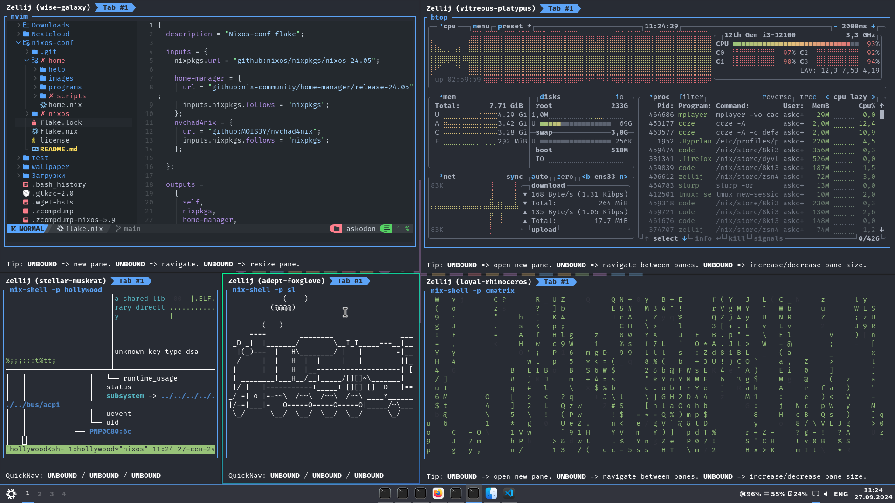

[](https://nixos.org)

> [!IMPORTANT]
> add this too configuration.nix:
> nix.settings.experimental-features = [ "nix-command" "flakes" ];

First install
```
git clone https://github.com/Askodon/nixos-conf.git /home/askodon/nixos-conf
sudo /home/askodon/nixos-conf/new_install.sh
```

Update
```
sudo rm -r /home/askodon/nixos-conf
git clone https://github.com/Askodon/nixos-conf.git /home/askodon/nixos-conf
sudo nixos-rebuild switch --flake /home/askodon/nixos-conf/nixos/
```
#image

